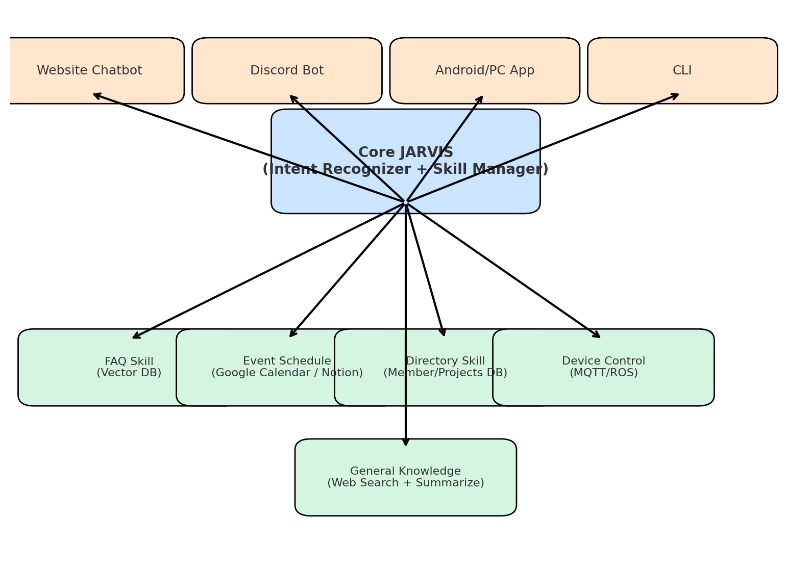

# jarvis
Personal Assistant for the AI &amp; Robotics Club

Check my contribution here ( Web Search & Summarization Feature ): 
- [Link](https://github.com/Ajay-Kumar-Prasad/jarvis/tree/main/Skills/web_search)
# Phase 1: Core Architecture Setup



1. Define the JARVIS Framework**

- **Create a modular architecture :**

  - Intent Recognizer → routes user queries

  - Skill Manager → dispatches to the right skill

  - Response Generator → formats response for the interface (Discord/CLI/Web).

- **Use a message-passing pattern (like an internal API or event bus)**

- **Maintain a common API layer so all interfaces call the same backend**

2. Skill Manager

- **Make a skill_registry where each skill registers with:**

  - intent_name

  - handler_function

  - required_params

- **Example:**
```
{
  "faq": "faq_handler",
  "event_schedule": "calendar_handler",
  "directory": "directory_handler",
  "device_control": "mqtt_handler",
  "general_knowledge": "web_handler"
}
```
# 📍 Phase 2: Implement Skills

Start with simple implementations, then improve.

1. FAQ Skill

  - **Store FAQs in a Vector DB (Pinecone, Weaviate, FAISS)**

  - **Pipeline**:

    - User query → embed → semantic search → return best answer.

  - **Tools:** sentence-transformers, FAISS (local), or OpenAI Embeddings.

2. Event Schedule Skill

  - **Connect Google Calendar API / Notion API**

  - **Features**:

    - Fetch upcoming events.

    - Answer queries like “What’s happening this weekend?”.

  - **Use Google API client or Notion SDK**

3. Directory Skill

  - Create a club database (JSON, SQL, or Airtable).

  - Store members, roles, projects, contact info.

  - Handler: query DB and return formatted info.

  - Example: “Who is the Robotics Lead?” → “John Doe (john@club.com
  )”.

4. Device Control Skill

  - Integrate with MQTT or ROS.

  - **Example flow:**

    - Intent: “Move rover forward 10m.”

    - Skill: Publish rover/move {forward: 10} to MQTT broker.

    - Start with simple commands, later expand to multiple robotics devices.

5. General Knowledge Skill

  - **Use a Web Search API (SerpAPI, Bing Web Search, DuckDuckGo API)**

  - **Steps:**

    - Fetch top results.

    - Summarize with LLM (or extract snippets).

    - Return concise response.

# 📍 Phase 3: Interfaces (One Brain, Many Interfaces)

  - **All interfaces → call central JARVIS backend.**

  - **Website Chatbot (JARVIS 1)**

    - Frontend: React chatbot UI.

    - Backend: Flask/FastAPI/Node.js → routes to JARVIS core.

  - **Discord Bot**

    - Use discord.js (Node.js) or discord.py.

    - On message → send text to JARVIS backend → return response.

  - **Android/PC App**

    - Android: Flutter/React Native → API calls to JARVIS backend.

    - PC: Simple Electron app**

  - **CLI**

Python CLI → takes input → calls backend → prints response.

# 📍 Phase 4: Orchestration & Enhancement

  - **Context Handling**

    - Maintain short-term conversation memory.

    - Example:

    - User: “When is Robotics meeting?”

    - JARVIS: “Friday at 6PM.”

    - User: “Where is it?” → use context → “Robotics Lab.”

  - **Fallback System**

    - If FAQ/Directory/Event/Device Control fail → fallback to General Knowledge Skill.

  - **Logging & Analytics**

    - Store all queries and intents.

    - Track “intent coverage” → helps improve FAQ and Directory.

# 📍 Phase 5: Advanced Features

  - Add voice interface (speech-to-text + TTS).

  - Add agentic workflows (JARVIS can perform multi-step tasks).

  - Add user authentication for private info (events, member details).

## Overview

This project integrates two main components:

1. **Intent Classification**
   - Understands the user's goal from natural language input.
   - Produces structured output (JSON) containing `intent` and `entities`.

2. **AI Browser Agent**
   - Maps intents to browser actions automatically.
   - Executes tasks on the web without manual intervention.

This combination allows **automated execution of complex web tasks** triggered by natural language commands.

---

## Features

- Accepts natural language commands
- Automatic intent classification
- Entity extraction for parameterized actions
- Browser automation using Playwright or Selenium
- Supports multi-step task execution
- Modular architecture for easy extension
- Optional feedback or result extraction

---

## Architecture
```
User Input (Natural Language)
↓
Intent Classifier (NLP Model)
↓
Intent + Entities (JSON)
↓
Action Planner / Task Mapper
↓
AI Browser Agent (Playwright / Selenium)
↓
Task Execution / Feedback
```
## File Structure

```
ai_browser_agent/
│
├─ run_agent.py         # Entry point to run the agent
├─ actions.py           # Action mapping and browser execution
├─ sample_input.json    # Sample intent classifier output
├─ requirements.txt
```

## Setup & Installation

1. **Clone the repository**
```bash
git clone https://github.com/username/intent-agent.git
cd intent-agent
```

Install dependencies
```
pip install -r requirements.txt
```

Install Playwright browsers
```
playwright install
```

Set API keys (if using GPT API) in .env file:
```
OPENAI_API_KEY=your_api_key_here
```
Usage
Run the agent with a sample intent JSON:

```
python run_agent.py
```

Sample intent JSON input

```
{
  "intent": "add_to_cart",
  "entities": {"product": "milk"}
}
```
Agent automatically performs the task in the browser.

```
Example Workflow
User Input:
"Add milk to my shopping cart"
```

Intent Classifier Output:
```
{
  "intent": "add_to_cart",
  "entities": {"product": "milk"}
}
```

Action Planner Maps Intent → Actions:
```
[
  {"action": "open_page", "url": "https://www.example.com/shop"},
  {"action": "search", "product": "milk"},
  {"action": "click", "selector": ".add-to-cart-btn"}
]
```

- AI Browser Agent Executes Actions Automatically

- Task Completed / Feedback Provided

- Contributing
```
Fork the repository

Create a new branch: git checkout -b feature/your-feature

Commit changes: git commit -m "Add new feature"

Push branch: git push origin feature/your-feature

Open a Pull Request
```

License
This project is licensed under the MIT License – see the LICENSE file for details.


